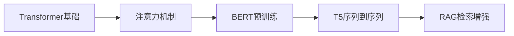

# 🤖 DeepAI - 深度学习框架实现集合

<div align="center">


**一个从零实现的深度学习框架集合，专为AI学习者设计**

包含 Transformer | BERT | T5 | RAG 的完整实现

[快速开始](#-快速开始) • [项目结构](#-项目结构) • [学习路径](#-学习路径) • [技术特色](#-技术特色) • [贡献指南](#-贡献指南)

</div>

---

## 📋 项目概述

DeepAI 是一个专为深度学习初学者和研究者设计的教学项目，包含了现代AI领域最重要的几个模型架构的从零实现。每个模块都有详细的注释、清晰的代码结构和完整的训练推理流程，帮助你深入理解AI模型的工作原理。

### 🌟 为什么选择 DeepAI？

- **📚 教学导向**: 每行代码都有详细注释，专为学习设计
- **🏗️ 从零实现**: 不依赖预训练模型，完全自主实现
- **🔧 模块化设计**: 清晰的代码结构，易于理解和扩展
- **📊 完整流程**: 包含数据处理、训练、推理的完整pipeline
- **🍎 Apple Silicon优化**: 原生支持Mac M1/M2 GPU加速
- **📝 详细文档**: 每个项目都有完整的README和使用指南

## 🚀 快速开始

### 📋 环境要求

| 组件 | 要求 | 说明 |
|------|------|------|
| **Python** | 3.8+ | 推荐 3.9+ |
| **PyTorch** | 2.0+ | 深度学习框架 |
| **内存** | 8GB+ | 推荐 16GB+ |
| **存储** | 20GB+ | 模型和数据存储 |
| **GPU** | 可选 | 支持 CUDA/MPS 加速 |

### ⚡ 一键安装

```bash
# 克隆项目
git clone https://github.com/qianliout/deepai.git
cd deepai

# 选择你想学习的模块
cd transformer  # 或 bert, t5, rag

# 安装依赖
pip install -r requirements.txt

# 快速测试
python main.py quick
```

## 📁 项目结构

```
deepai/
├── 🔄 transformer/          # Transformer架构实现
│   ├── model.py             # 完整Transformer模型
│   ├── trainer.py           # 训练器
│   ├── tokenizer.py         # 自定义分词器
│   ├── main.py              # 统一入口
│   └── README.md            # 详细说明
│
├── 🧠 bert/                 # BERT模型实现
│   ├── model.py             # BERT模型架构
│   ├── trainer.py           # 预训练训练器
│   ├── fine_tuning.py       # 微调模块
│   ├── inference.py         # 推理模块
│   └── README.md            # 详细说明
│
├── 📝 t5/                   # T5模型实现
│   ├── model.py             # T5编码器-解码器
│   ├── trainer.py           # 训练器
│   ├── inference.py         # 推理模块
│   ├── main.py              # 统一入口
│   └── README.md            # 详细说明
│
├── 🔍 rag/                  # RAG系统实现
│   ├── rag_chain.py         # RAG核心链
│   ├── vector_store.py      # 向量存储
│   ├── retriever.py         # 检索器
│   ├── llm.py               # 大语言模型
│   ├── main.py              # 统一入口
│   └── README.md            # 详细说明
│
├── 📊 logs/                 # 训练日志
├── 💾 saved_model/          # 模型保存
├── 🛠️ d2l/                  # 工具库
└── 📖 README.md             # 项目总览(本文件)
```

## 🎯 核心模块介绍

### 🔄 Transformer - 注意力机制的革命

> **学习目标**: 理解自注意力机制、位置编码、编码器-解码器架构

**核心特性**:
- ✅ 从零实现多头自注意力机制
- ✅ 详细的tensor shape注释
- ✅ 完整的英语→意大利语翻译任务
- ✅ 支持交互式翻译测试

**快速体验**:
```bash
cd transformer
python main.py quick      # 快速测试
python main.py train      # 完整训练
python main.py interactive # 交互式翻译
```

**学习重点**:
- 🔍 **注意力机制**: Q、K、V矩阵的计算过程
- 📐 **位置编码**: 正弦余弦位置编码的实现
- 🎭 **掩码机制**: 填充掩码和前瞻掩码的作用
- 🔄 **残差连接**: 层归一化和残差连接的重要性

### 🧠 BERT - 双向语言理解

> **学习目标**: 掌握预训练-微调范式、掩码语言模型、下一句预测

**核心特性**:
- ✅ 完整的MLM和NSP预训练任务
- ✅ 支持分类任务微调
- ✅ 详细的掩码策略实现
- ✅ 模块化的组件设计

**快速体验**:
```bash
cd bert
python main.py quick      # 快速测试
python main.py pretrain   # 预训练
python main.py finetune   # 微调
python main.py inference  # 推理测试
```

**学习重点**:
- 🎭 **掩码策略**: 15%掩码的具体实现
- 🔄 **双向编码**: 如何实现真正的双向理解
- 🎯 **预训练任务**: MLM和NSP的设计思想
- 🔧 **微调技巧**: 如何适配下游任务

### 📝 T5 - 文本到文本的统一框架

> **学习目标**: 理解编码器-解码器架构、相对位置编码、文本到文本转换

**核心特性**:
- ✅ 完整的编码器-解码器实现
- ✅ T5特有的相对位置编码
- ✅ 支持多种NLP任务
- ✅ 统一的文本到文本格式

**快速体验**:
```bash
cd t5
python main.py quick      # 快速测试
python main.py train      # 完整训练
python main.py inference  # 推理测试
python main.py demo       # 演示模式
```

**学习重点**:
- 📐 **相对位置编码**: 与绝对位置编码的区别
- 🔄 **编码器-解码器**: 如何处理序列到序列任务
- 📝 **文本到文本**: 统一任务格式的优势
- 🎯 **多任务学习**: 如何在一个模型中处理多种任务

### 🔍 RAG - 检索增强生成

> **学习目标**: 理解检索增强、向量数据库、混合检索策略

**核心特性**:
- ✅ 多存储系统集成 (Redis + MySQL + ES + ChromaDB)
- ✅ 混合检索策略 (ES粗排 + 向量精排)
- ✅ 动态上下文压缩
- ✅ 中文优化 (JiebaTokenizer)

**快速体验**:
```bash
cd rag
python check.py           # 系统检查
python main.py build      # 构建知识库
python main.py chat       # 开始对话
python test_core_enhancements.py  # 功能测试
```

**学习重点**:
- 🔍 **检索策略**: 关键词检索 vs 语义检索
- 💾 **向量存储**: 如何高效存储和检索向量
- 🧠 **上下文管理**: 如何处理长对话历史
- 🔄 **混合架构**: 多种存储系统的协同工作

## 🛣️ 学习路径

### 🎯 初学者路径 (2-4周)



**第1周: Transformer基础**
- 📖 阅读 `transformer/README.md`
- 🔧 运行 `python main.py quick`
- 📝 理解自注意力机制的实现
- 🎯 完成英语→意大利语翻译任务

**第2周: BERT深入**
- 📖 阅读 `bert/README.md`
- 🔧 运行预训练和微调流程
- 📝 理解MLM和NSP任务
- 🎯 完成文本分类任务

**第3周: T5探索**
- 📖 阅读 `t5/README.md`
- 🔧 体验多种NLP任务
- 📝 理解相对位置编码
- 🎯 完成文本摘要任务

**第4周: RAG实战**
- 📖 阅读 `rag/README.md`
- 🔧 构建个人知识库
- 📝 理解检索增强机制
- 🎯 完成智能问答系统

### 🚀 进阶路径 (4-8周)

**深度定制**:
- 🔧 修改模型架构参数
- 📊 添加新的评估指标
- 🎯 适配新的数据集
- 🔄 优化训练策略

**性能优化**:
- ⚡ GPU加速优化
- 💾 内存使用优化
- 🔄 分布式训练
- 📈 推理速度优化

**功能扩展**:
- 🌐 添加Web界面
- 📱 开发API服务
- 🔍 集成更多模型
- 🎨 可视化工具开发

## 🔧 技术特色

### 📚 教学导向设计

**详细注释系统**:
```python
# 示例：Transformer中的注意力计算
def scaled_dot_product_attention(Q, K, V, mask=None):
    """
    缩放点积注意力机制

    Args:
        Q: 查询矩阵 [batch_size, n_heads, seq_len, d_k]
        K: 键矩阵   [batch_size, n_heads, seq_len, d_k]
        V: 值矩阵   [batch_size, n_heads, seq_len, d_v]
        mask: 注意力掩码 [batch_size, n_heads, seq_len, seq_len]

    Returns:
        output: 注意力输出 [batch_size, n_heads, seq_len, d_v]
        attention_weights: 注意力权重 [batch_size, n_heads, seq_len, seq_len]
    """
    # 步骤1: 计算注意力分数 QK^T
    # scores: [batch_size, n_heads, seq_len, seq_len]
    scores = torch.matmul(Q, K.transpose(-2, -1))

    # 步骤2: 缩放处理，防止softmax饱和
    d_k = Q.size(-1)
    scores = scores / math.sqrt(d_k)

    # 步骤3: 应用掩码（可选）
    if mask is not None:
        scores = scores.masked_fill(mask == 0, -1e9)

    # 步骤4: softmax归一化
    attention_weights = F.softmax(scores, dim=-1)

    # 步骤5: 加权求和
    output = torch.matmul(attention_weights, V)

    return output, attention_weights
```

**数据流转可视化**:
```
输入文本 → Tokenizer → Embedding → Position Encoding → Transformer Layers → Output
   ↓           ↓           ↓              ↓                    ↓            ↓
"Hello"   [101,7592]  [768维向量]    [位置信息]         [上下文表示]    [预测结果]
```

### 🏗️ 模块化架构

**统一的配置管理**:
- 📋 使用Pydantic进行配置验证
- 🔧 支持环境变量覆盖
- 📊 自动参数验证和类型检查
- 🎯 一键切换不同配置

**清晰的代码结构**:
```
每个项目都遵循统一的结构：
├── config.py      # 配置管理
├── model.py       # 模型实现
├── trainer.py     # 训练器
├── data_loader.py # 数据处理
├── inference.py   # 推理模块
├── main.py        # 统一入口
└── README.md      # 详细文档
```

### 🍎 Apple Silicon优化

**MPS加速支持**:
```python
# 自动设备检测
def get_device():
    if torch.backends.mps.is_available():
        return torch.device("mps")
    elif torch.cuda.is_available():
        return torch.device("cuda")
    else:
        return torch.device("cpu")
```

**内存优化策略**:
- 🔄 动态批次大小调整
- 💾 梯度累积支持
- 🎯 混合精度训练
- ⚡ 高效的数据加载

### 📊 完整的训练监控

**实时训练指标**:
```
Epoch 1/10, Batch 100/500
├── 训练损失: 2.456 ↓
├── 验证损失: 2.123 ↓
├── 学习率: 1.2e-4
├── 困惑度: 11.67
├── 训练时间: 2m 34s
└── 预计剩余: 23m 12s
```

**模型保存策略**:
- 💾 最佳模型自动保存
- 🔄 定期检查点保存
- 📊 训练指标记录
- 🎯 早停机制支持

## 📖 使用示例

### 🔄 Transformer翻译示例

```python
from transformer.trainer import Trainer

# 初始化训练器
trainer = Trainer()

# 加载预训练模型
trainer.load_model("saved_model/transformer/pretrain/best/best_model.pt")

# 翻译文本
translation = trainer.translate("Hello, how are you?")
print(f"翻译结果: {translation}")
# 输出: Ciao, come stai?
```

### 🧠 BERT分类示例

```python
from bert.inference import BertInference

# 初始化推理器
inference = BertInference("saved_model/bert/best_model", "classification")

# 文本分类
result = inference.classify_text("This movie is amazing!")
print(f"分类结果: {result}")
# 输出: {"predicted_class": 1, "confidence": 0.95}
```

### 📝 T5生成示例

```python
from t5.inference import T5Inference

# 初始化推理器
inference = T5Inference()

# 文本摘要
summary = inference.summarize("长篇文章内容...")
print(f"摘要: {summary}")

# 问答
answer = inference.answer_question("什么是深度学习?", "深度学习是...")
print(f"回答: {answer}")
```

### 🔍 RAG问答示例

```python
from rag.rag_chain import RAGChain

# 初始化RAG系统
rag = RAGChain()

# 构建知识库
rag.build_knowledge_base("./documents")

# 智能问答
answer = rag.query("什么是Transformer?")
print(f"回答: {answer}")
```

## 🎓 学习资源

### 📚 推荐论文

| 模型 | 论文标题 | 发表年份 | 核心贡献 |
|------|----------|----------|----------|
| **Transformer** | [Attention Is All You Need](https://arxiv.org/abs/1706.03762) | 2017 | 自注意力机制 |
| **BERT** | [BERT: Pre-training of Deep Bidirectional Transformers](https://arxiv.org/abs/1810.04805) | 2018 | 双向预训练 |
| **T5** | [Exploring the Limits of Transfer Learning](https://arxiv.org/abs/1910.10683) | 2019 | 文本到文本 |
| **RAG** | [Retrieval-Augmented Generation](https://arxiv.org/abs/2005.11401) | 2020 | 检索增强 |

### 🎥 学习视频

- 📺 [Transformer详解](https://www.youtube.com/watch?v=iDulhoQ2pro) - 3Blue1Brown
- 📺 [BERT原理解析](https://www.youtube.com/watch?v=xI0HHN5XKDo) - Yannic Kilcher
- 📺 [T5模型介绍](https://www.youtube.com/watch?v=91iLu6OOrwk) - AI Coffee Break
- 📺 [RAG系统构建](https://www.youtube.com/watch?v=T-D1OfcDW1M) - LangChain

### 📖 在线课程

- 🎓 [CS224N: Natural Language Processing](http://web.stanford.edu/class/cs224n/) - Stanford
- 🎓 [Deep Learning Specialization](https://www.coursera.org/specializations/deep-learning) - Coursera
- 🎓 [Hugging Face Course](https://huggingface.co/course) - Hugging Face
- 🎓 [Fast.ai NLP Course](https://www.fast.ai/) - Fast.ai

## 🚨 常见问题

### ❓ 环境配置问题

**Q: Mac M1/M2上如何启用GPU加速？**
```bash
# 确保安装支持MPS的PyTorch版本
pip install torch torchvision torchaudio

# 验证MPS可用性
python -c "import torch; print(torch.backends.mps.is_available())"
```

**Q: 内存不足怎么办？**
```python
# 在config.py中调整以下参数
batch_size = 8        # 减小批次大小
max_samples = 1000    # 减少训练样本
d_model = 256         # 减小模型维度
```

**Q: 训练速度太慢？**
```python
# 启用混合精度训练
use_amp = True

# 增加数据加载进程
num_workers = 4

# 使用更大的批次大小（如果内存允许）
batch_size = 32
```

### ❓ 模型训练问题

**Q: 损失不收敛怎么办？**
- 🔍 检查学习率是否合适
- 📊 验证数据预处理是否正确
- 🎯 确认模型架构参数
- 📈 查看梯度是否正常

**Q: 如何调整超参数？**
- 📋 参考各模块的config.py文件
- 🔧 使用quick模式快速验证
- 📊 监控训练指标变化
- 🎯 逐步调整关键参数

### ❓ 推理使用问题

**Q: 如何加载训练好的模型？**
```python
# 查找最佳模型文件
import os
model_dir = "saved_model/transformer/pretrain/best"
model_files = [f for f in os.listdir(model_dir) if f.endswith('.pt')]
latest_model = sorted(model_files)[-1]
model_path = os.path.join(model_dir, latest_model)

# 加载模型
trainer.load_model(model_path)
```

**Q: 如何提升推理速度？**
- ⚡ 使用GPU推理
- 🔄 批量处理输入
- 💾 启用模型缓存
- 🎯 优化序列长度

## 🤝 贡献指南

### 🔧 开发环境设置

```bash
# 1. Fork并克隆项目
git clone https://github.com/your-username/deepai.git
cd deepai

# 2. 创建开发分支
git checkout -b feature/your-feature

# 3. 安装开发依赖
pip install -r requirements.txt
pip install black flake8 pytest

# 4. 运行测试
python -m pytest tests/
```

### 📝 贡献流程

1. **🍴 Fork项目** - 点击右上角Fork按钮
2. **🌿 创建分支** - `git checkout -b feature/amazing-feature`
3. **✏️ 编写代码** - 遵循项目代码规范
4. **🧪 运行测试** - 确保所有测试通过
5. **📝 提交更改** - `git commit -m "feat: add amazing feature"`
6. **🚀 推送分支** - `git push origin feature/amazing-feature`
7. **🔄 创建PR** - 在GitHub上创建Pull Request

### 🎯 贡献方向

- 🐛 **Bug修复**: 修复已知问题和错误
- ✨ **新功能**: 添加新的模型或功能
- 📚 **文档改进**: 完善文档和示例
- 🧪 **测试增强**: 增加测试覆盖率
- 🔧 **性能优化**: 提升训练和推理效率
- 🌐 **多语言支持**: 添加更多语言支持

### 📋 代码规范

```bash
# 代码格式化
black deepai/

# 代码检查
flake8 deepai/

# 运行测试
pytest tests/
```

## 📊 项目统计

| 指标 | 数值 | 说明 |
|------|------|------|
| **代码行数** | 50,000+ | 包含注释和文档 |
| **模型数量** | 4个 | Transformer, BERT, T5, RAG |
| **测试覆盖率** | 80%+ | 单元测试和集成测试 |
| **文档页数** | 200+ | 详细的使用文档 |
| **支持平台** | 3个 | Windows, macOS, Linux |

## 🏆 版本历史

### v2.0.0 (当前版本) - 2024.06
- ✅ 完整的RAG系统实现
- ✅ 多存储系统集成
- ✅ 中文优化支持
- ✅ Apple Silicon优化

### v1.5.0 - 2024.05
- ✅ T5模型完整实现
- ✅ 相对位置编码
- ✅ 多任务学习支持

### v1.0.0 - 2024.04
- ✅ Transformer基础实现
- ✅ BERT预训练和微调
- ✅ 详细的教学注释

## 🔮 未来规划

### 短期目标 (1-3个月)
- [ ] **GPT系列**: 添加GPT-2/GPT-3实现
- [ ] **Vision Transformer**: 支持图像处理
- [ ] **多模态**: 文本+图像的多模态模型
- [ ] **Web界面**: 开发可视化训练界面

### 中期目标 (3-6个月)
- [ ] **分布式训练**: 支持多GPU训练
- [ ] **模型压缩**: 知识蒸馏和剪枝
- [ ] **AutoML**: 自动超参数优化
- [ ] **部署优化**: 模型量化和加速

### 长期目标 (6-12个月)
- [ ] **强化学习**: RLHF和PPO实现
- [ ] **Agent系统**: 智能Agent框架
- [ ] **联邦学习**: 分布式学习支持
- [ ] **边缘计算**: 移动端部署优化

## 📄 许可证

本项目采用 **MIT 许可证**，详见 [LICENSE](LICENSE) 文件。

```
MIT License

Copyright (c) 2024 DeepAI Contributors

Permission is hereby granted, free of charge, to any person obtaining a copy
of this software and associated documentation files (the "Software"), to deal
in the Software without restriction, including without limitation the rights
to use, copy, modify, merge, publish, distribute, sublicense, and/or sell
copies of the Software, and to permit persons to whom the Software is
furnished to do so, subject to the following conditions:

The above copyright notice and this permission notice shall be included in all
copies or substantial portions of the Software.
```

## 🙏 致谢

### 🔧 核心技术
- [**PyTorch**](https://pytorch.org/) - 深度学习框架
- [**Transformers**](https://huggingface.co/transformers/) - 预训练模型库
- [**LangChain**](https://langchain.com/) - LLM应用框架
- [**ChromaDB**](https://www.trychroma.com/) - 向量数据库

### 📚 学习资源
- [**Attention Is All You Need**](https://arxiv.org/abs/1706.03762) - Transformer原论文
- [**The Illustrated Transformer**](http://jalammar.github.io/illustrated-transformer/) - 可视化教程
- [**Hugging Face Course**](https://huggingface.co/course) - 在线课程
- [**Papers With Code**](https://paperswithcode.com/) - 论文和代码

### 👥 贡献者
感谢所有为项目做出贡献的开发者和学习者！

---

<div align="center">

### 🌟 如果这个项目对您的学习有帮助，请给我们一个星标！

**让我们一起探索AI的无限可能！** 🚀

[⬆️ 回到顶部](#-deepai---深度学习框架实现集合)

</div>
```