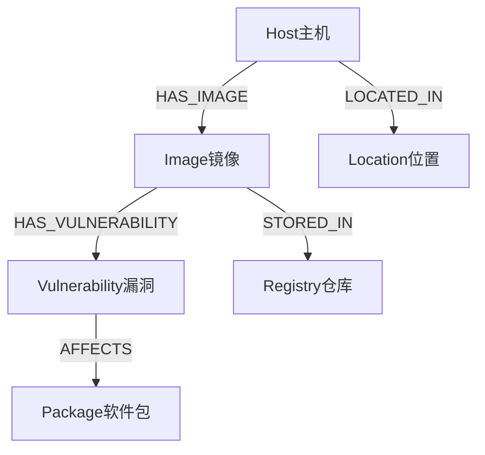

# 知识图谱学习指南 - 基于AIOps RAG系统实践

## 📚 目录
1. [知识图谱基础概念](#1-知识图谱基础概念)
2. [图数据模型设计](#2-图数据模型设计)
3. [Neo4j图数据库实践](#3-neo4j图数据库实践)
4. [知识图谱与RAG融合](#4-知识图谱与rag融合)
5. [查询理解与实体识别](#5-查询理解与实体识别)
6. [实际应用场景](#6-实际应用场景)
7. [性能优化策略](#7-性能优化策略)
8. [学习路径建议](#8-学习路径建议)

---

## 1. 知识图谱基础概念

### 1.1 什么是知识图谱？

知识图谱是一种**结构化的知识表示方法**，用图的形式来描述现实世界中实体之间的关系。

```
传统数据存储 vs 知识图谱：

关系数据库：
主机表: [ID, 主机名, IP]
镜像表: [ID, 镜像名, 版本]
漏洞表: [ID, CVE, 严重程度]

知识图谱：
(主机)-[运行]->(镜像)-[包含]->(漏洞)
```

### 1.2 核心组成要素

#### 🔹 实体 (Entity)
- **定义**: 现实世界中的具体对象
- **示例**: 主机web-server-01、镜像nginx:1.20.2、漏洞CVE-2023-44487
- **在Neo4j中**: 表示为节点(Node)

#### 🔹 关系 (Relation)
- **定义**: 实体之间的连接和交互
- **示例**: HAS_IMAGE(拥有镜像)、HAS_VULNERABILITY(包含漏洞)
- **在Neo4j中**: 表示为边(Edge/Relationship)

#### 🔹 属性 (Property)
- **定义**: 实体或关系的特征描述
- **示例**: 主机的IP地址、漏洞的CVSS评分、关系的创建时间
- **在Neo4j中**: 键值对形式存储

### 1.3 知识图谱的优势

| 传统方法 | 知识图谱方法 |
|---------|-------------|
| 表格式存储，关系隐含 | 图式存储，关系显式 |
| 多表JOIN查询复杂 | 图遍历查询直观 |
| 难以表达复杂关系 | 天然支持多跳关系 |
| 扩展性差 | 灵活扩展新实体类型 |

---

## 2. 图数据模型设计

### 2.1 实体设计原则

#### 🎯 实体识别
```cypher
// 主机实体 - 物理或虚拟计算资源
(:Host {
    id: 1,
    hostname: "web-server-01",
    ip_address: "192.168.1.10",
    os_type: "Ubuntu",
    location: "北京机房A",
    status: "online"
})

// 镜像实体 - 容器镜像
(:Image {
    id: 1,
    image_name: "nginx",
    image_tag: "1.20.2",
    registry: "docker.io",
    size_mb: 142
})

// 漏洞实体 - 安全漏洞
(:Vulnerability {
    id: 1,
    cve_id: "CVE-2023-44487",
    severity: "HIGH",
    cvss_score: 7.5,
    description: "HTTP/2 Rapid Reset attack"
})
```

#### 🎯 实体设计最佳实践
1. **唯一标识**: 每个实体都有唯一ID
2. **语义清晰**: 实体类型名称要有明确含义
3. **属性完整**: 包含业务所需的关键属性
4. **标准化**: 统一命名规范和数据格式

### 2.2 关系设计原则

#### 🔗 关系类型设计
```cypher
// 主机-镜像关系
(:Host)-[:HAS_IMAGE {
    container_name: "web-nginx-01",
    status: "running",
    ports: "80:80,443:443",
    created_at: datetime()
}]->(:Image)

// 镜像-漏洞关系
(:Image)-[:HAS_VULNERABILITY {
    affected_package: "nginx",
    package_version: "1.20.2",
    fixed_version: "1.20.3",
    detected_at: datetime()
}]->(:Vulnerability)
```

#### 🔗 关系设计最佳实践
1. **方向性**: 明确关系的方向和含义
2. **属性丰富**: 关系可以携带上下文信息
3. **时间戳**: 记录关系的时间信息
4. **业务语义**: 关系名称要符合业务理解

### 2.3 图模式(Schema)设计



---

## 3. Neo4j图数据库实践

### 3.1 Cypher查询语言基础

#### 🔍 基本查询模式
```cypher
// 1. 节点查询
MATCH (h:Host) 
WHERE h.hostname = "web-server-01"
RETURN h

// 2. 关系查询
MATCH (h:Host)-[r:HAS_IMAGE]->(i:Image)
RETURN h.hostname, i.image_name, r.status

// 3. 路径查询
MATCH (h:Host)-[:HAS_IMAGE]->(i:Image)-[:HAS_VULNERABILITY]->(v:Vulnerability)
WHERE v.severity = "CRITICAL"
RETURN h.hostname, i.image_name, v.cve_id
```

#### 🔍 高级查询技巧
```cypher
// 聚合查询 - 统计每台主机的漏洞数量
MATCH (h:Host)-[:HAS_IMAGE]->(i:Image)-[:HAS_VULNERABILITY]->(v:Vulnerability)
WITH h, count(DISTINCT v) as vuln_count
RETURN h.hostname, vuln_count
ORDER BY vuln_count DESC

// 条件过滤 - 查找高危漏洞影响的主机
MATCH (v:Vulnerability)<-[:HAS_VULNERABILITY]-(i:Image)<-[:HAS_IMAGE]-(h:Host)
WHERE v.cvss_score >= 7.0
RETURN DISTINCT h.hostname, count(v) as high_risk_count

// 可选匹配 - 包含没有漏洞的镜像
MATCH (h:Host)-[:HAS_IMAGE]->(i:Image)
OPTIONAL MATCH (i)-[:HAS_VULNERABILITY]->(v:Vulnerability)
RETURN h.hostname, i.image_name, count(v) as vuln_count
```

### 3.2 索引和约束优化

```cypher
// 创建唯一约束
CREATE CONSTRAINT host_id_unique FOR (h:Host) REQUIRE h.id IS UNIQUE;
CREATE CONSTRAINT cve_id_unique FOR (v:Vulnerability) REQUIRE v.cve_id IS UNIQUE;

// 创建索引
CREATE INDEX host_hostname_index FOR (h:Host) ON (h.hostname);
CREATE INDEX vulnerability_severity_index FOR (v:Vulnerability) ON (v.severity);
CREATE INDEX vulnerability_cvss_index FOR (v:Vulnerability) ON (v.cvss_score);
```

### 3.3 事务管理

```python
# Python中的事务处理示例
def create_host_with_images(self, host_data, images_data):
    """事务中创建主机及其镜像"""
    def _execute_transaction(tx):
        # 创建主机
        host_result = tx.run(
            "CREATE (h:Host $props) RETURN h",
            props=host_data
        )
        host_id = host_result.single()['h']['id']
        
        # 创建镜像和关系
        for image_data in images_data:
            tx.run("""
                MATCH (h:Host {id: $host_id})
                CREATE (i:Image $image_props)
                CREATE (h)-[:HAS_IMAGE $rel_props]->(i)
                """, 
                host_id=host_id,
                image_props=image_data['image'],
                rel_props=image_data['relationship']
            )
    
    with self.driver.session() as session:
        session.execute_write(_execute_transaction)
```

---

## 4. 知识图谱与RAG融合

### 4.1 融合架构设计

```
用户查询 → 查询理解 → 并行检索 → 结果融合 → 增强生成
    ↓         ↓         ↓         ↓         ↓
  意图识别   实体提取   向量+图谱   智能融合   带依据回答
```

### 4.2 查询分类策略

我们的系统实现了智能查询分类：

```python
class QueryClassifier:
    def __init__(self):
        self.patterns = {
            QueryType.VULNERABILITY_IMPACT: [
                r'CVE-\d{4}-\d+',           # CVE编号模式
                r'漏洞.*影响',               # 影响分析
                r'哪些.*主机.*受影响'        # 影响范围查询
            ],
            QueryType.HOST_RISK_ASSESSMENT: [
                r'主机.*风险',               # 风险评估
                r'.*服务器.*安全',           # 安全评估
                r'.*主机.*存在.*漏洞'        # 漏洞查询
            ]
        }
```

### 4.3 结果融合机制

```python
def fuse_results(self, vector_results, graph_result, query):
    """智能融合向量检索和图检索结果"""
    
    # 1. 构建图谱知识部分（结构化事实）
    graph_context = f"【知识图谱信息】\n{graph_result.summary}\n"
    
    # 2. 添加具体事实
    if graph_result.query_type == QueryType.VULNERABILITY_IMPACT:
        graph_context += self._format_vulnerability_facts(graph_result.structured_data)
    
    # 3. 构建向量检索部分（文档内容）
    vector_context = "【文档检索信息】\n"
    for result in vector_results[:5]:
        vector_context += f"• {result['content'][:200]}...\n"
    
    # 4. 优先级融合：图谱事实 > 文档内容
    return graph_context + vector_context
```

### 4.4 增强提示生成

```python
# 针对知识图谱优化的提示词
prompt = f"""你是一个专业的AIOps AI助手，擅长分析主机、镜像和漏洞之间的关系。

上下文信息：
{fused_context}

回答要求：
1. 优先使用知识图谱中的结构化事实信息
2. 在回答中明确标注信息来源（如：根据知识图谱显示...）
3. 对于漏洞影响分析，要具体说明受影响的主机和镜像
4. 保持回答的准确性和可操作性

用户问题：{question}
"""
```

---

## 5. 查询理解与实体识别

### 5.1 实体识别技术

#### 🎯 基于规则的实体识别
```python
def extract_entities(self, query: str) -> Dict[str, List[str]]:
    """从查询中提取实体"""
    entities = {
        'cve_ids': [],
        'hostnames': [],
        'ip_addresses': [],
        'image_names': []
    }
    
    # CVE ID识别
    cve_pattern = r'CVE-\d{4}-\d+'
    entities['cve_ids'] = re.findall(cve_pattern, query, re.IGNORECASE)
    
    # IP地址识别
    ip_pattern = r'\b(?:\d{1,3}\.){3}\d{1,3}\b'
    entities['ip_addresses'] = re.findall(ip_pattern, query)
    
    # 主机名识别
    hostname_patterns = [
        r'web-server-\d+',
        r'db-server-\d+',
        r'app-server-\d+'
    ]
    
    return entities
```

#### 🎯 基于NER模型的实体识别
```python
# 使用预训练NER模型
from transformers import AutoTokenizer, AutoModelForTokenClassification

class AdvancedEntityExtractor:
    def __init__(self):
        self.tokenizer = AutoTokenizer.from_pretrained("dbmdz/bert-large-cased-finetuned-conll03-english")
        self.model = AutoModelForTokenClassification.from_pretrained("dbmdz/bert-large-cased-finetuned-conll03-english")
    
    def extract_entities(self, text):
        # 实现基于BERT的实体识别
        pass
```

### 5.2 查询意图理解

```python
class IntentClassifier:
    """查询意图分类器"""
    
    def classify_intent(self, query: str) -> Tuple[QueryType, float]:
        """分类查询意图并返回置信度"""
        
        # 特征提取
        features = self._extract_features(query)
        
        # 规则匹配
        if self._contains_cve_pattern(query):
            return QueryType.VULNERABILITY_IMPACT, 0.9
        
        if self._contains_host_pattern(query):
            return QueryType.HOST_RISK_ASSESSMENT, 0.8
        
        # 机器学习分类（可扩展）
        return self._ml_classify(features)
```

---

## 6. 实际应用场景

### 6.1 漏洞影响分析

**场景**: 发现新漏洞CVE-2024-1234，需要快速评估影响范围

**传统方式**:
```sql
-- 需要多个复杂的JOIN查询
SELECT h.hostname, i.image_name 
FROM hosts h
JOIN host_images hi ON h.id = hi.host_id
JOIN images i ON hi.image_id = i.id
JOIN image_vulnerabilities iv ON i.id = iv.image_id
JOIN vulnerabilities v ON iv.vulnerability_id = v.id
WHERE v.cve_id = 'CVE-2024-1234';
```

**知识图谱方式**:
```cypher
-- 一个直观的图遍历查询
MATCH (v:Vulnerability {cve_id: 'CVE-2024-1234'})<-[:HAS_VULNERABILITY]-(i:Image)<-[:HAS_IMAGE]-(h:Host)
RETURN h.hostname, h.ip_address, i.image_name, i.image_tag
ORDER BY h.hostname;
```

**RAG增强回答**:
```
根据知识图谱分析，CVE-2024-1234影响以下资源：

🏠 受影响主机（3台）：
• web-server-01 (192.168.1.10) - 北京机房A
• web-server-02 (192.168.1.11) - 北京机房A  
• app-server-01 (192.168.1.30) - 上海机房A

📦 受影响镜像：
• nginx:1.20.2 (运行在web-server-01, web-server-02)
• app:v2.1 (运行在app-server-01)

⚠️ 风险评估：
• 严重程度：HIGH (CVSS: 8.1)
• 影响范围：3台主机，2个镜像类型
• 业务影响：Web服务和应用服务

🔧 修复建议：
1. 优先修复web服务器（业务关键）
2. 升级nginx至1.20.3版本
3. 升级app镜像至v2.2版本

（数据来源：知识图谱实时分析）
```

### 6.2 主机安全评估

**查询**: "web-server-01的安全状况如何？"

**图谱查询**:
```cypher
MATCH (h:Host {hostname: 'web-server-01'})-[:HAS_IMAGE]->(i:Image)-[:HAS_VULNERABILITY]->(v:Vulnerability)
RETURN h, i, v
ORDER BY v.cvss_score DESC;
```

**智能回答**:
```
web-server-01安全评估报告：

📊 总体风险：HIGH
• 总漏洞数：12个
• 严重漏洞：2个 (CRITICAL)
• 高危漏洞：4个 (HIGH)
• 中危漏洞：6个 (MEDIUM)

🔍 关键风险点：
1. CVE-2024-1234 (CRITICAL, CVSS: 9.8)
   - 影响镜像：nginx:1.20.2
   - 风险：远程代码执行
   
2. CVE-2024-5678 (HIGH, CVSS: 8.1)
   - 影响镜像：app:v2.1
   - 风险：权限提升

🎯 修复优先级：
1. 立即修复：CRITICAL级漏洞（预计停机30分钟）
2. 本周内修复：HIGH级漏洞
3. 下月修复：MEDIUM级漏洞

（基于知识图谱实时风险分析）
```

---

## 7. 性能优化策略

### 7.1 图数据库优化

#### 🚀 索引策略
```cypher
-- 为常用查询字段创建索引
CREATE INDEX host_hostname_index FOR (h:Host) ON (h.hostname);
CREATE INDEX vulnerability_cvss_index FOR (v:Vulnerability) ON (v.cvss_score);
CREATE INDEX image_name_tag_index FOR (i:Image) ON (i.image_name, i.image_tag);

-- 复合索引用于复杂查询
CREATE INDEX vulnerability_severity_cvss_index FOR (v:Vulnerability) ON (v.severity, v.cvss_score);
```

#### 🚀 查询优化
```cypher
-- 优化前：全图扫描
MATCH (h:Host)-[:HAS_IMAGE]->(i:Image)-[:HAS_VULNERABILITY]->(v:Vulnerability)
WHERE v.severity = 'CRITICAL'
RETURN h.hostname;

-- 优化后：从漏洞开始查询
MATCH (v:Vulnerability {severity: 'CRITICAL'})<-[:HAS_VULNERABILITY]-(i:Image)<-[:HAS_IMAGE]-(h:Host)
RETURN DISTINCT h.hostname;
```

### 7.2 缓存策略

```python
class CachedGraphRetriever:
    def __init__(self):
        self.cache = {}
        self.cache_ttl = 300  # 5分钟缓存
    
    def retrieve_with_cache(self, query: str):
        cache_key = hashlib.md5(query.encode()).hexdigest()
        
        # 检查缓存
        if cache_key in self.cache:
            cached_result, timestamp = self.cache[cache_key]
            if time.time() - timestamp < self.cache_ttl:
                return cached_result
        
        # 执行查询
        result = self.graph_retriever.retrieve(query)
        
        # 更新缓存
        self.cache[cache_key] = (result, time.time())
        
        return result
```

### 7.3 分页和限制

```cypher
-- 分页查询大结果集
MATCH (v:Vulnerability)<-[:HAS_VULNERABILITY]-(i:Image)<-[:HAS_IMAGE]-(h:Host)
WITH v, count(DISTINCT h) as affected_hosts
ORDER BY affected_hosts DESC
SKIP $offset LIMIT $limit
RETURN v.cve_id, v.severity, affected_hosts;
```

---

## 8. 学习路径建议

### 8.1 基础阶段 (1-2周)

#### 📖 理论学习
- [ ] 图论基础概念
- [ ] 知识图谱基本原理
- [ ] Neo4j基础教程
- [ ] Cypher查询语言

#### 🛠️ 实践练习
```cypher
-- 练习1：基本CRUD操作
CREATE (h:Host {name: "test-host", ip: "192.168.1.100"});
MATCH (h:Host {name: "test-host"}) SET h.status = "online";
MATCH (h:Host {name: "test-host"}) DELETE h;

-- 练习2：关系操作
MATCH (h:Host), (i:Image) 
WHERE h.name = "web-01" AND i.name = "nginx"
CREATE (h)-[:RUNS]->(i);
```

### 8.2 进阶阶段 (2-3周)

#### 📖 深入学习
- [ ] 图算法（最短路径、中心性分析）
- [ ] 知识图谱构建方法
- [ ] 实体链接和消歧
- [ ] 图嵌入技术

#### 🛠️ 项目实践
- [ ] 构建小型知识图谱
- [ ] 实现基本的图查询API
- [ ] 集成到简单的问答系统

### 8.3 高级阶段 (3-4周)

#### 📖 前沿技术
- [ ] 图神经网络(GNN)
- [ ] 知识图谱推理
- [ ] 多模态知识图谱
- [ ] 大规模图处理

#### 🛠️ 复杂应用
- [ ] 实现本项目的完整功能
- [ ] 性能优化和扩展
- [ ] 与大语言模型深度集成

### 8.4 推荐资源

#### 📚 书籍
- 《知识图谱：概念与技术》- 漆桂林
- 《Graph Databases》- Ian Robinson
- 《Learning Neo4j》- Rik Van Bruggen

#### 🌐 在线资源
- Neo4j官方文档：https://neo4j.com/docs/
- Stanford CS224W图机器学习课程
- 知识图谱开源项目：OpenKG

#### 🔧 实践工具
- Neo4j Desktop：图形化管理界面
- Neo4j Browser：交互式查询工具
- Gephi：图可视化工具

---

## 🎯 总结

通过本项目的实践，你已经掌握了：

1. **知识图谱基础**：实体、关系、属性的建模方法
2. **Neo4j实战**：从安装部署到复杂查询优化
3. **RAG融合**：知识图谱与大语言模型的深度集成
4. **工程实践**：完整的系统架构和代码实现

知识图谱不仅仅是一种数据存储方式，更是一种**知识表示和推理的范式**。它能够：
- 🔍 **显式表达**复杂的实体关系
- 🧠 **支持推理**和知识发现
- 🤖 **增强AI**系统的可解释性
- 📈 **提升业务**决策的准确性

继续深入学习，你将能够构建更加智能和强大的知识驱动应用！
